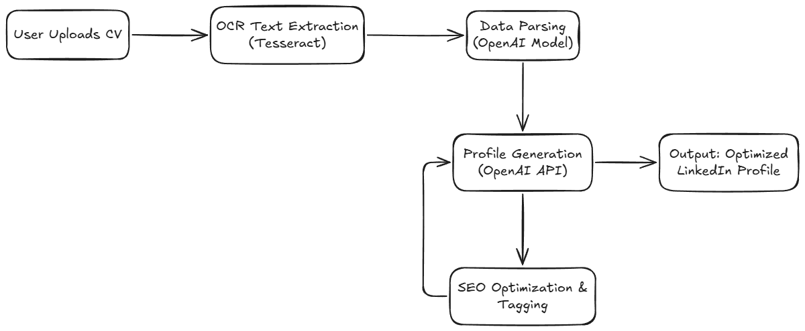

# CV Genius - Professional Profile Generator


CV Genius is a web application that helps professionals transform their CVs into optimized LinkedIn profiles with SEO-friendly summaries and keywords. The application uses AI-powered text extraction and analysis to generate professional profile content.

## Features

- **CV Parsing**: Upload your CV (PDF or image) to automatically extract key information
- **Profile Generation**: Create optimized LinkedIn profiles with professional summaries
- **SEO Optimization**: Get recommended tags and keywords to improve profile visibility
- **Contact Validation**: Ensures extracted contact information is properly formatted
- **Responsive Design**: Works on both desktop and mobile devices

## Technologies Used

- **Backend**:
  - Python
  - FastAPI (web framework)
  - OpenAI API (text generation)
  - Hugging Face (OCR fallback)
  - Tesseract OCR (text extraction)
  - PDF2Image (PDF processing)

- **Frontend**:
  - HTML5, CSS3, JavaScript
  - Jinja2 Templates
  - Responsive design with CSS Grid/Flexbox

## Installation

### Prerequisites

- Python 3.9+
- Tesseract OCR installed on your system
- Node.js (for optional frontend development)

### Pipeline



### Setup

1. Clone the repository:
   ```bash
   git clone https://github.com/RamiIbrahim2002/R-sum--automatique-de-profil-avec-IA-dans-le-cadre-du-projet-TYBSync--3-.git
   cd cv-genius
   ```

2. Create and activate a virtual environment:
   ```bash
   python -m venv venv
   source venv/bin/activate  # On Windows: venv\Scripts\activate
   ```

3. Install dependencies:
   ```bash
   pip install -r requirements.txt
   ```

4. Set up environment variables:
   - Create a `.env` file in the root directory
   - Add your API keys:
     ```
     OPENAI_API_KEY=your_openai_key
     OPENAI_MODEL=gpt-3.5-turbo  # or your preferred model
     ```

5. Install Tesseract OCR:
   - **Windows**: Download from [Tesseract installer](https://github.com/UB-Mannheim/tesseract/wiki)
   - **Mac**: `brew install tesseract`
   - **Linux**: `sudo apt install tesseract-ocr`

## Usage

1. Run the FastAPI server:
   ```bash
   uvicorn main:app --reload --port 8000
   ```

2. Open your browser and navigate to:
   ```
   http://localhost:8000
   ```

3. Use the application:
   - Upload your CV (PDF, JPG, or PNG)
   - Review the extracted information
   - Generate an optimized LinkedIn profile

## API Endpoints

- `POST /process-cv/`: Process uploaded CV file
- `POST /generate`: Generate profile summary from form data

## Project Structure

```
cv-genius/
├── static/               # Static files (CSS, JS, images)
│   ├── style.css         # Main stylesheet
│   └── screenshot.png    # Application screenshot
├── templates/            # HTML templates
│   └── index.html        # Main application page
├── main.py               # FastAPI application
├── requirements.txt      # Python dependencies
└── README.md             # Project documentation
```

## Configuration

You can configure the following in the `.env` file:

| Variable          | Description                          | Default           |
|-------------------|--------------------------------------|-------------------|
| OPENAI_API_KEY    | Your OpenAI API key                  | -                 |
| OPENAI_MODEL      | OpenAI model to use                  | gpt-3.5-turbo     |
| TESSERACT_CMD     | Path to Tesseract executable         | System dependent  |

## License

This project is licensed under the MIT License - see the [LICENSE](LICENSE) file for details.

## Acknowledgements

- FastAPI for the excellent web framework
- OpenAI for their powerful language models
- Hugging Face for their OCR API
- Tesseract OCR for text extraction
```

This README includes:
1. Project overview
2. Key features
3. Technology stack
4. Installation instructions
5. Usage guide
6. API documentation
7. Project structure
8. Configuration options
9. Contribution guidelines
10. License information
11. Acknowledgements

You can customize it further by:
- Adding screenshots (replace the placeholder)
- Including a demo video link
- Adding badges for build status, license, etc.
- Expanding the API documentation section
- Adding deployment instructions for different platforms